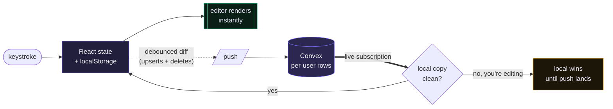

<div align="center">

# braindot

**A personal knowledge management workspace where notes connect, reading flows in, and an AI tutor teaches you.**

Not a filing cabinet. A thinking environment.

[**Live demo →**](https://braindot.vercel.app/demo) &nbsp;·&nbsp; no signup required


</div>

---

## What it is

Most note apps are folders with a text box. braindot is built on one idea: **a note is worth
more for what it connects to than for what it contains.** Everything in the app follows from
that — wiki-links, automatic backlinks, a graph that shows the shape of your thinking, and an
AI that can read across your whole vault rather than one note at a time.

It is local-first. Every keystroke lands in local state immediately and syncs to the cloud in
the background, so writing never waits on a network round trip.

## Features

**Writing**
- Markdown editor with a live syntax overlay — you edit raw markdown, styled in place
- `[[wiki-link]]` autocomplete, and backlinks computed across the vault automatically
- Paste an article from the web and it converts to clean markdown instead of losing its structure
- Edit / preview / diff modes, undo-redo, slash commands, list continuation
- Pick your reading font: monospace, serif or sans (the interface stays monospace)

**Organising**
- PARA folder structure with nesting, drag and drop, and pinning
- Tag view, full-text and semantic search
- Kanban board and todo list, both linkable to notes
- Freeform canvas for spatial thinking

**AI** (OpenAI)
- **Ask this note** — a writing partner that can see the note you're working on
- **Ask your vault** — retrieval across every note, with cited sources
- **Study mode** — an interactive Socratic tutor that quizzes you back and renders diagrams,
  timelines and study calendars, which you can save straight into your notes
- Everything streams token by token

**Reading**
- Import EPUB and PDF, or pull live articles from Hacker News and papers from arXiv
- Highlight passages and turn them into notes

**Interface**
- Light and dark themes
- Knowledge graph with a force-directed layout
- Command palette (`⌘K`)

<table>
<tr>
<td width="50%"><br><sub><b>Knowledge graph</b> — nodes sized by how connected they are</sub></td>
<td width="50%"><br><sub><b>Study mode</b> — a tutor that draws, and saves into your notes</sub></td>
</tr>
</table>

## Stack

| | |
|---|---|
| **Framework** | Next.js 16, React 19, TypeScript |
| **Backend** | Convex — database, auth, and live sync |
| **AI** | OpenAI, streamed |
| **Diagrams** | Mermaid |
| **Styling** | Tailwind v4 plus a hand-rolled CSS variable design system |

## Running it locally

```bash
bun install
```

Create `.env.local`:

```bash
# Convex — from your Convex dashboard
CONVEX_DEPLOY_KEY=your_deploy_key
NEXT_PUBLIC_CONVEX_URL=https://your-deployment.convex.cloud

# OpenAI — powers the AI features
OPENAI_API_KEY=sk-...
OPENAI_MODEL=gpt-4o-mini
```

Push the backend, then start the dev server:

```bash
bun run convex:deploy
bun run dev
```

Open <http://localhost:3000>.

> Setting `OPENAI_API_KEY=mock` streams a canned response instead of calling the API, which is
> useful for working on the AI interfaces without spending tokens.

### Convex auth setup

The Password provider needs three environment variables set on the Convex deployment itself,
not in `.env.local`. Generate an RS256 keypair, then:

```bash
npx convex env set JWT_PRIVATE_KEY -- "$(cat jwt.txt)"
npx convex env set JWKS -- "$(cat jwks.txt)"
npx convex env set SITE_URL https://your-app-url
```

Full deployment walkthrough: [DEPLOYMENT.md](DEPLOYMENT.md).

## How the sync works



The interesting architectural decision is that the client is the source of truth while you are
typing.

Every collection lives in React state and localStorage, so interactions are instant and the
editor caret never jumps. A generic hook (`useCollectionSync`) mirrors each collection to
Convex:

1. **Pull once on sign-in.** If the cloud has data it wins; if the cloud is empty but local has
   a vault, that vault is uploaded — which is how an existing local user migrates on first login.
2. **Push a debounced diff** of upserts and deletes, keyed by a client-generated `localId` so
   the client never waits for a server id.
3. **Merge remote changes live.** The pull is a Convex subscription, so edits from another
   device arrive continuously and are applied whenever the local copy of that document is
   clean. A document you are actively editing always wins until your write lands.

Conflict resolution is last-writer-wins per document, which is the right trade for a
single-user tool.

## Project layout

```
src/
  app/            routes, API handlers, landing page, global CSS
  components/
    second-brain/ the application (editor, graph, canvas, reading, study mode…)
    ui/           shadcn primitives
  hooks/          state and sync (useNotes, useEditor, useCollectionSync…)
  utils/          markdown, retrieval, graph layout, diffing
convex/
  schema.ts       tables, all scoped per user
  functions.ts    the sync API (pull / push / wipe)
  auth.ts         Convex Auth, password provider
```

## Notes on security

Identity is verified server-side on every Convex call via the session token, and rows are keyed
by a stable user id — a client cannot read another user's data by editing localStorage. Secrets
live only in `.env.local` and in the Vercel and Convex environments; nothing sensitive is
committed.

## Status

Working beta, deployed and in use. Built with AI assistance.

---

<div align="center">
<sub>MIT</sub>
</div>
